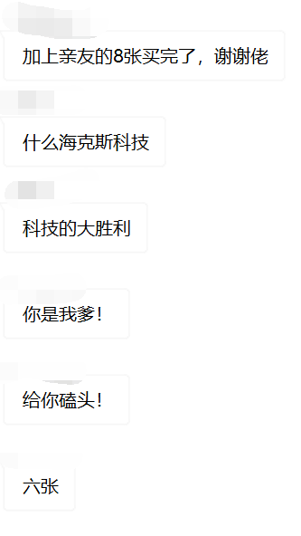
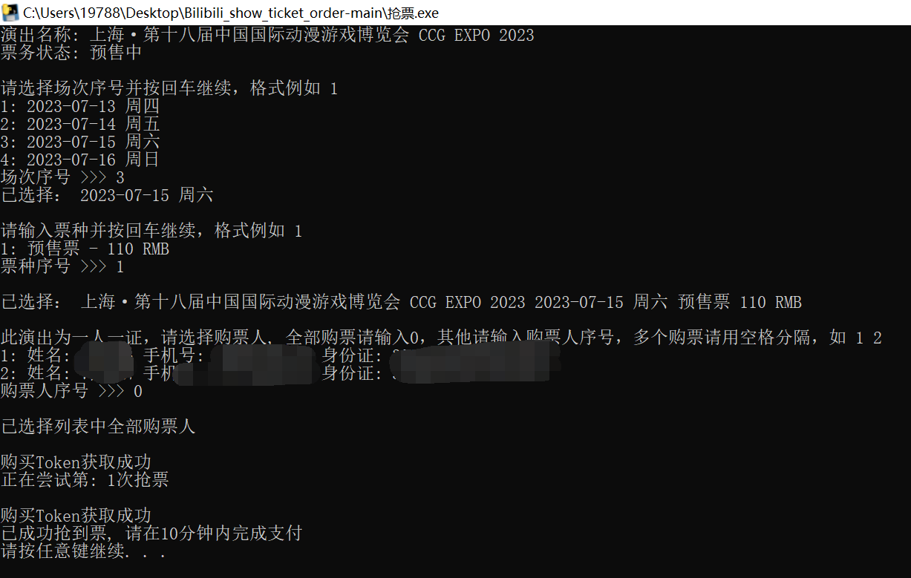

# Bilibili_show_ticket_auto_order

本项目核心借鉴自https://github.com/Hobr 佬

Bilibili会员购抢票助手, 通过B站接口抢购目标漫展/演出

本脚本仅供学习交流使用, 不得用于商业用途, 如有侵权请联系删除




## 致谢

以下排名不分先后，我也不想搞的攀比起来，因为很多都是学生，原则上我是不收赞助的，大家太热情了：

------------------------------------------------++++

```
晚安乃琳Queen
kankele
倔强
宵宫
yxw
星海云梦
穆桉
mizore
傩祓
CChhdCC
w2768
iiiiimilet
利维坦战斧
路人
Impact
骤雨初歇
明月夜
晓读
Simpson
Goognaloli
闹钟
LhiaS
洛天华
```

------------------------------------------------++++


## 功能截图

除了登录纯api请求

目前已经支持漫展演出等的 无证 / 单证 / 一人一证 的购买




## 使用

相关内容感谢@123485k的提交

### 执行exe

登录和抢票分开的，先运行登录.exe，登陆后再运行抢票.exe，运行了之后不要急着选，先把验证.exe启动起来

不需要依赖

如果运行失败的请安装依赖[Edgewebdriver](https://developer.microsoft.com/en-us/microsoft-edge/tools/webdriver/)

### 执行脚本

```shell
python login.py
python main.py
python geetest.py
```

该装的东西自己装

### 新功能：微信公众号推送结果

需要关注pushplus微信公众号，关注后激活，然后点击个人中心-获取token，在config.txt中填入token即可在需要验证或者抢票成功后收到微信公众号通知

## 配置说明

config.txt为配置文件，不指定值为None

- proxies 指定代理 如：127.0.0.1:8080 (IP:PORT 请不要加前缀)
- specificID 多个用户登陆后指定某一个人uid(bilibili) (多用户还没做等后面有必要再写)
- sleep设置每次抢票请求间隔时间
- token设置pushplus的个人token

## API文档

pass

## 问题报告

提issue即可

## 更新

加入token验证，手动拉滑块

加入微信公众号推送消息功能
